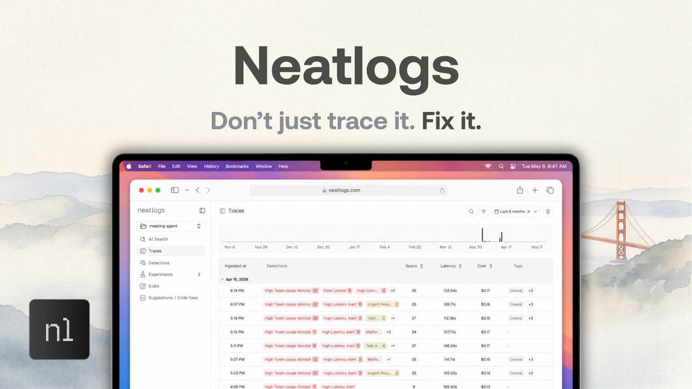

<div align="center">

<h1>neatlogs</h1>

<p>LLM observability for AI agents.<br/>Instrument once. Inspect everything.</p>

<p>
  <a href="https://badge.fury.io/py/neatlogs"></a>
  
  
</p>

<p>
  <a href="https://neatlogs.com">Website</a> &nbsp;·&nbsp;
  <a href="https://docs.neatlogs.com">Docs</a> &nbsp;·&nbsp;
  <a href="https://neatlogs.com">Get API key</a>
</p>

<br/>

<p><i>Agent failures don't throw exceptions — they produce wrong outputs, miss tool calls, or hallucinate.<br/>Neatlogs captures every trace so you can see exactly what the model was given, what it decided, and what each step returned.</i></p>

</div>

---



## Quickstart

```bash
pip install neatlogs
```

```python
import neatlogs

neatlogs.init(
    api_key="your-api-key",
    workflow_name="my-agent",
    instrumentations=["openai", "langchain"],
)
```

Every LLM call, tool invocation, and retrieval step is now captured. No decorators, no wrappers. Call `neatlogs.init()` before importing any instrumented library.

---

## Core features

- **[Traces](https://docs.neatlogs.com/features/traces)**: Every agent run is captured as a full span tree — LLM calls, tool invocations, retrievals, reranking, and guardrail checks — with inputs, outputs, token counts, cost, and latency. When something goes wrong, the trace shows you exactly what the model was given, what it decided, and what each step returned.

- **[Timeline view](https://docs.neatlogs.com/features/traces#timeline)**: Maps every span onto a time axis so you can see which steps ran in parallel, where latency concentrated, and where the process was simply idle. Gaps between bars are real — a network call, a lock, an async scheduler doing nothing useful.

- **[AI assistant](https://docs.neatlogs.com/features/traces#ai-assistant)**: Each trace has a built-in assistant with full read access to the run. Ask it why the agent didn't call a tool, what context the model was given, or which step dominated wall-clock time — answers are grounded in the actual span data, not a generic product description.

- **[AI Search](https://docs.neatlogs.com/features/ai-search)**: Query across all your traces in plain English without building filters or writing SQL. Fast mode returns results immediately; Pro mode reasons across the data for deeper analysis.

- **[Detections](https://docs.neatlogs.com/features/detections)**: Define rules that automatically flag matching spans — regex patterns, numeric conditions, PII presence, or model-based classifiers. Flagged traces surface as badges in the dashboard so regressions don't stay hidden in a list of green runs.

- **[Prompt management](https://docs.neatlogs.com/features/experiments)**: Version-control your prompts, promote versions to production with a label change, and test in the built-in Playground before shipping. No redeployment needed to roll back a bad prompt.

- **[Comments & voting](https://docs.neatlogs.com/features/comments)**: Pin notes to any span, @mention teammates, and vote outputs up or down. Votes are stored at the span level and filterable across your workflow — a lightweight way to build labelled eval sets as you debug production traces.

---

## Supported libraries

Pass any combination of these keys to `instrumentations` in `neatlogs.init()`. Call `neatlogs.init()` before importing any instrumented library.

### LLM providers

| Provider | Key | Install |
|---|---|---|
| OpenAI | `openai` | `pip install "neatlogs[openai]"` |
| Anthropic | `anthropic` | `pip install "neatlogs[anthropic]"` |
| Google Gemini | `google_genai` | `pip install "neatlogs[google-genai]"` |
| Azure OpenAI | `azure_ai_inference` | `pip install "neatlogs[azure-ai-inference]"` |
| AWS Bedrock | `bedrock` | `pip install "neatlogs[bedrock]"` |
| LiteLLM | `litellm` | `pip install "neatlogs[litellm]"` |

### Agent frameworks

| Framework | Key | Install |
|---|---|---|
| LangChain | `langchain` | `pip install "neatlogs[langchain]"` |
| LangGraph | `langgraph` | `pip install "neatlogs[langgraph]"` |
| CrewAI | `crewai` | `pip install "neatlogs[crewai]"` |

### Vector stores

| Store | Key | Notes |
|---|---|---|
| ChromaDB | `chromadb` | Auto-instrumented when installed |
| Pinecone | `pinecone` | Auto-instrumented when installed |
| Qdrant | `qdrant` | Auto-instrumented when installed |
| Weaviate | `weaviate` | Auto-instrumented when installed |
| Milvus | `milvus` | `pip install "neatlogs[milvus]"` |
| Redis | `redis` | Auto-instrumented when installed |
| OpenSearch | `opensearch` | Auto-instrumented when installed |
| Elasticsearch | `elasticsearch` | Auto-instrumented when installed |
| Marqo | `marqo` | Auto-instrumented when installed |

---

## Manual spans

Use `@neatlogs.span` to instrument your own agents, tools, and orchestration logic:

```python
@neatlogs.span(kind="WORKFLOW")
def handle_request(user_input: str) -> str:
    ...

@neatlogs.span(kind="TOOL", tool_name="web-search")
def search(query: str) -> list:
    ...
```

Available kinds: `WORKFLOW` · `AGENT` · `CHAIN` · `TOOL` · `RETRIEVER` · `RERANKER` · `EMBEDDING` · `GUARDRAIL` · `MCP_TOOL` · `VECTOR_STORE`

---

## License

MIT
