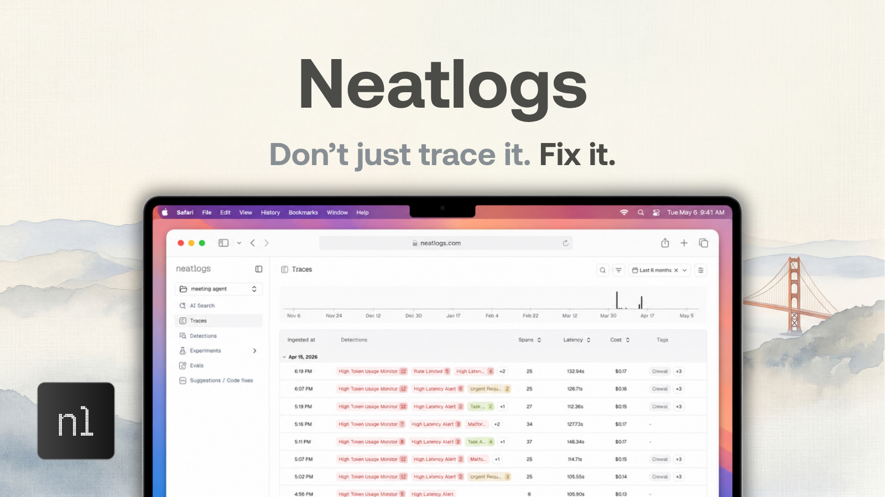

<div align="center">

<h1>neatlogs</h1>

<p>LLM observability for AI agents.<br/>Instrument once. Inspect everything.</p>

<p>
  <a href="https://badge.fury.io/py/neatlogs"></a>
  
  
</p>

<p>
  <a href="https://neatlogs.com">Website</a> &nbsp;·&nbsp;
  <a href="https://docs.neatlogs.com">Docs</a> &nbsp;·&nbsp;
  <a href="https://app.neatlogs.com">Get API key</a> &nbsp;·&nbsp;
  <a href="https://github.com/neatlogs/skills">AI Skill</a>
</p>

<br/>

<p><i>Agent failures don't throw exceptions — they produce wrong outputs, miss tool calls, or hallucinate.<br/>Neatlogs captures every trace so you can see exactly what the model was given, what it decided, and what each step returned.</i></p>

</div>

---



## Installation

```bash
pip install neatlogs
```

Optional extras install the underlying LLM / framework libraries:

```bash
pip install "neatlogs[openai]"
pip install "neatlogs[crewai]"
pip install "neatlogs[langchain,langgraph]"
pip install "neatlogs[google-genai]"
```

Requires **Python >= 3.10, < 3.14**.

---

## Quickstart

```python
import neatlogs
from neatlogs import span

neatlogs.init(
    api_key="your-api-key",       # or NEATLOGS_API_KEY env var
    workflow_name="my-agent",
    instrumentations=["openai"],
)

# Import instrumented libraries AFTER init()
from openai import OpenAI


@span(kind="WORKFLOW", name="quickstart")
def main():
    client = OpenAI()
    return client.chat.completions.create(
        model="gpt-4o-mini",
        messages=[{"role": "user", "content": "What is AI?"}],
    )


main()
neatlogs.flush()
neatlogs.shutdown()
```

Auto-instrumentation captures LLM calls, tools, and retrievals as child spans. Use `@span(kind="WORKFLOW")` on your main function or request handler so each run shows up as a top-level trace in the dashboard.

Call `neatlogs.init()` **before** importing any instrumented library.

For long-running servers (FastAPI, Celery workers), call `init()` once at startup and decorate each request handler with `@span(kind="WORKFLOW")`. Do **not** call `flush()` / `shutdown()` per request.

Full walkthrough: [Your First Trace](https://docs.neatlogs.com/quickstart/your-first-trace).

### Payload delivery status

Normal OTLP batches are byte-limited and gzip-compressed. Deploy and verify gzip-aware trace
intake before releasing this SDK version. Captured text values are bounded to 100,000 UTF-8 bytes
and telemetry items to a 1 MB capture budget. A truncated value contains its original byte length,
SHA-256 digest, and `backend_upload_contract_unavailable`; spans/logs also carry
`neatlogs.capture.*` diagnostics, exposed through `get_delivery_diagnostics()`.

Typed-media metadata is detected without fetching remote content. Credential-bearing remote
locators are reduced to scheme/host/path, and large inline media is replaced in captured bodies by
typed unavailable metadata rather than a base64 prefix. Authenticated large-media and oversized
trace uploads are available behind the default-off `uploads_enabled=True` option (or
`NEATLOGS_UPLOADS_ENABLED=true`). The SDK masks first, prepares an API-key-authenticated upload,
PUTs only to the returned HTTPS object URL, completes backend validation, and exports only a small
canonical `ready` reference. Signed URLs and headers never enter telemetry. In-progress, rejected,
expired, or otherwise incomplete uploads fail explicitly and are exposed through
`get_delivery_diagnostics()`; an oversized item is never also sent through ordinary ingest.

### Prompt client boundary

Prompt-management requests are product-data API calls, not trace telemetry. The telemetry
`mask=` callback does not transform prompt content passed to `PromptClient`; apply any desired
prompt transformation before calling the prompt API. The prompt client authenticates with the
configured project API key and endpoint independently of the telemetry exporter.

Unpinned and label-based reads use a configurable 60-second cache by default. An expired entry is
returned immediately while one background refresh runs for that key; a refresh failure leaves the
stale entry available for the next retry. Explicitly versioned reads stay pinned to that immutable
version for the lifetime of the client. Each client retains at most 100 prompt selectors and runs
at most four background refreshes concurrently. Call `PromptClient.close()` when an explicitly
constructed client is no longer needed. `neatlogs.shutdown()` closes the module-level prompt
clients created from `init()` so a later SDK generation cannot reuse an earlier project's key or
cache. Prompt API failures do not flush, stop, or reconfigure the telemetry provider, and API
response bodies are not copied into SDK error messages.

---

## Integrate into your codebase (recommended)

The fastest way to add NeatLogs to an existing project is the official **Agent Skill** — it encodes import order, `@span` kinds, CrewAI prompt binding, and troubleshooting so your coding agent gets it right.

**Repo:** [github.com/neatlogs/skills](https://github.com/neatlogs/skills)

```bash
npx skills add neatlogs/skills --skill "neatlogs-py"
```

For **Cursor**:

```bash
npx skills add neatlogs/skills --skill "neatlogs-py" --agent "cursor"
```

No Node.js? Ask in chat: *"Install the NeatLogs AI skill from github.com/neatlogs/skills"*

Example prompts once installed:

- *"Add neatlogs tracing to my OpenAI calls"*
- *"Instrument my CrewAI agents with neatlogs"*
- *"Wrap my FastAPI handler so each request is a top-level trace"*

Full install options: [skills README](https://github.com/neatlogs/skills/blob/main/README.md).
The Wizard detects the project, downloads the needed Skill from the latest Skills
release, applies the documented instrumentation, and runs the applicable checks.

API reference: [docs.neatlogs.com](https://docs.neatlogs.com)

---

## Platform features

- **[Traces](https://docs.neatlogs.com/features/traces)**: Full span trees — LLM calls, tools, retrievals, reranking, guardrails — with inputs, outputs, tokens, cost, and latency.

- **[Timeline view](https://docs.neatlogs.com/features/traces#timeline)**: See which steps ran in parallel, where latency concentrated, and where the process was idle.

- **[AI assistant](https://docs.neatlogs.com/features/traces#ai-assistant)**: Ask questions grounded in the actual span data for a trace.

- **[AI Search](https://docs.neatlogs.com/features/ai-search)**: Query traces in plain English without writing SQL.

- **[Detections](https://docs.neatlogs.com/features/detections)**: Rules that flag matching spans — regex, numeric conditions, PII, or model classifiers.

- **[Prompt management](https://docs.neatlogs.com/features/experiments)**: Version prompts, promote labels, test in the Playground.

- **[Evals](https://app.neatlogs.com/evals)**: Human review campaigns — select traces or spans (or auto-collect future ones via filters), send custom rating forms to assigned reviewers, and track batch progress and scores.

- **[Comments & voting](https://docs.neatlogs.com/features/comments)**: Pin notes to spans, @mention teammates, and thumbs-up/down vote outputs while debugging a trace.

---

## Supported libraries

Pass keys to `instrumentations` in `neatlogs.init()`. Install extras when noted.

### LLM providers

| Provider | Key | Install |
|---|---|---|
| OpenAI | `openai` | `pip install "neatlogs[openai]"` |
| Anthropic | `anthropic` | `pip install "neatlogs[anthropic]"` |
| Google Gemini | `google_genai` | `pip install "neatlogs[google-genai]"` |
| Azure AI Inference | `azure_ai_inference` | `pip install "neatlogs[azure-ai-inference]"` |
| Azure OpenAI (`AzureOpenAI` client) | `openai` | `pip install "neatlogs[azure-openai]"` |
| AWS Bedrock | `bedrock` | `pip install "neatlogs[bedrock]"` |
| LiteLLM | `litellm` | `pip install "neatlogs[litellm]"` |
| Groq | `groq` | `pip install "neatlogs[groq]"` |
| Vertex AI | `vertexai` | `pip install "neatlogs[vertexai]"` |
| Vertex AI (google-genai SDK) | `vertex_ai` | `pip install "neatlogs[vertex-ai]"` |
| Mistral | `mistralai` | `pip install "neatlogs[mistralai]"` |
| Portkey | `portkey` | `pip install "neatlogs[portkey]"` |

### Agent frameworks

| Framework | Key | Install |
|---|---|---|
| LangChain | `langchain` | `pip install "neatlogs[langchain]"` |
| LangGraph | `langgraph` | `pip install "neatlogs[langgraph]"` |
| CrewAI | `crewai` | `pip install "neatlogs[crewai]"` |
| LlamaIndex | `llamaindex` | `pip install "neatlogs[llama-index]"` |
| Haystack | `haystack` | `pip install "neatlogs[haystack]"` |
| AutoGen | `autogen` | `pip install "neatlogs[autogen-agentchat]"` |
| DSPy | `dspy` | `pip install "neatlogs[dspy]"` |
| MCP | `mcp` | `pip install "neatlogs[mcp]"` |
| Agno | `agno` | `pip install "neatlogs[agno]"` |
| Google ADK | `google_adk` | `pip install "neatlogs[google-adk]"` |
| OpenAI Agents | `openai_agents` | `pip install "neatlogs[openai-agents]"` |
| Pydantic AI | `pydantic_ai` | `pip install "neatlogs[pydantic-ai]"` |
| smolagents | `smolagents` | `pip install "neatlogs[smolagents]"` |
| Hermes | `hermes` | `pip install "neatlogs[hermes]"` (Python 3.11+) |

### Structured output & guardrails

| Library | Key | Install |
|---|---|---|
| Instructor | `instructor` | `pip install "neatlogs[instructor]"` |
| Guardrails AI | `guardrails` | `pip install "neatlogs[guardrails]"` |

### Vector stores & HTTP

| Library | Key | Notes |
|---|---|---|
| ChromaDB | `chromadb` | Auto-instrumented when installed |
| Pinecone | `pinecone` | Auto-instrumented when installed |
| Qdrant | `qdrant` | Auto-instrumented when installed |
| Weaviate | `weaviate` | Auto-instrumented when installed |
| Milvus | `milvus` | `pip install "neatlogs[milvus]"` |
| Redis | `redis` | Auto-instrumented when installed |
| OpenSearch | `opensearch` | Auto-instrumented when installed |
| Elasticsearch | `elasticsearch` | Auto-instrumented when installed |
| Marqo | `marqo` | Auto-instrumented when installed |
| HTTP clients | `requests`, `httpx`, `urllib3`, `aiohttp` | Auto-instrumented when installed |

---

## Configuration

```bash
NEATLOGS_API_KEY=your-api-key
NEATLOGS_ENDPOINT=https://ingest.neatlogs.com   # optional — this is the default
```

Get your API key from the [NeatLogs dashboard](https://app.neatlogs.com). Full `init()` options: [reference](https://docs.neatlogs.com/reference/init-reference).

---

## Examples

Runnable reference apps live in [`examples/sdk_examples/`](examples/sdk_examples/). Each folder has a `requirements.txt` (PyPI install) and `.env.example`.

| Example | Framework | Run |
|---------|-----------|-----|
| `anthropic_multiagent/` | Anthropic + Bedrock | `python main.py` |
| `openai_multiagent/` | OpenAI via Azure | `python main.py` |
| `google_genai_multiagent/` | Google GenAI | `python main.py` |
| `langchain_react/` | LangChain ReAct | `python react_agent.py` |
| `langgraph_multiagent/` | LangGraph | `python main.py` |
| `langgraph_research_assistant/` | LangGraph | `python main.py` |
| `marketing_strategy_demo/` | CrewAI + Gemini search | `python main.py` |
| `neatlogs_support_bot/` | CrewAI RAG bot | `python main.py` |
| `reasoning_model_workflow/` | Multi-provider reasoning | `python main.py` |
| `support_copilot_demo/` | Support agent demo traces | `RUN=A python support_copilot.py` |
| `support_copilot_demo_triaged/` | Post-Triage support demo | `SENDGRID_FAKE_SUCCESS=1 RUN=B python support_copilot.py` |

**Adding NeatLogs to your own code?** Use the [AI skill](#integrate-into-your-codebase-recommended) above — not copy-paste from this README.

---

## Best practices

1. **`init()` before LLM imports** — auto-instrumentation patches libraries at import time.
2. **Wrap script/server entry points in `@span(kind="WORKFLOW")`** — each run gets a clear top-level trace in the dashboard.
3. **Use auto-instrumentation first** — only add more `@span` decorators for custom orchestration.
4. **`trace()` for prompts and sessions** — not as a wrapper around `@span(kind="WORKFLOW")`.
5. **`workflow_name` = feature name** — put env/version/tech stack in `tags=`.
6. **Scripts:** `flush()` then `shutdown()` at exit. **Servers:** `init()` once, no per-request shutdown.

---

## License

MIT — see [LICENSE](LICENSE).
