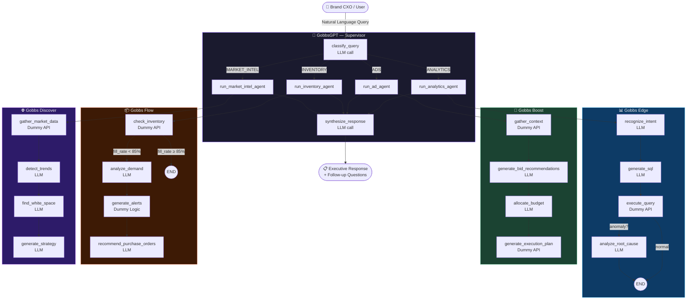
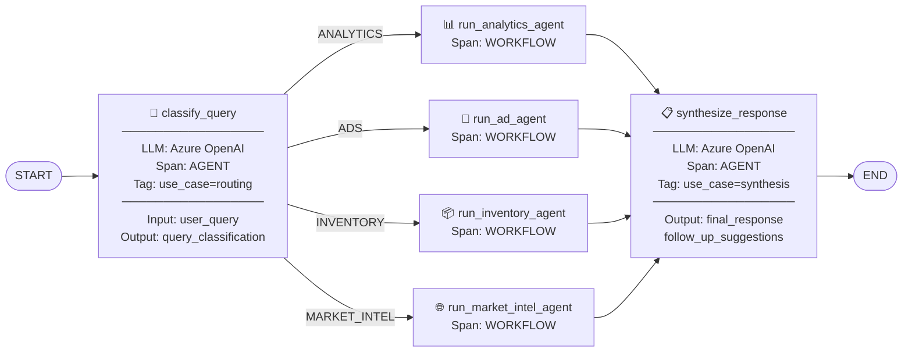
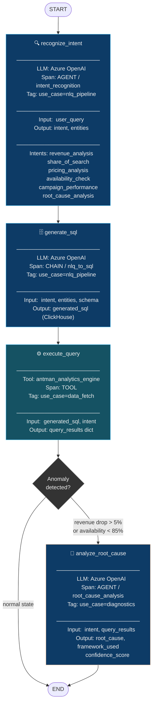
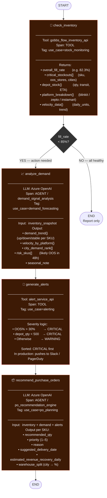

```mermaid
flowchart TD
    START([START]) --> GMD

    GMD["🌍 gather_market_data
    ────────────────────────
    Tool: market_data_api
    Span: TOOL
    Tag: use_case=market_research
    ────────────────────────
    Returns:
    • market_size_inr_cr + growth %
    • top_brands[] with market share
    • subcategory_breakdown[]
      (growth_pct, saturation, new_SKUs)
    • pricing_landscape
      (avg price, gap zones)
    • platform_distribution
    • city_tier split (Tier 1 vs 2)"]

    GMD --> DT

    DT["📡 detect_trends
    ────────────────────────
    LLM: Azure OpenAI
    Span: AGENT / trend_detector
    Tag: use_case=trend_analysis
    ────────────────────────
    Input:  market_data
    Output per trend:
    • trend_name
    • description
    • growth_signal_strength (1–10)
    • time_horizon (immediate / 3mo / 6mo)
    • relevant_cities[]
    • supporting_data_points[]"]

    DT --> FWS

    FWS["🔭 find_white_space
    ────────────────────────
    LLM: Azure OpenAI
    Span: AGENT / whitespace_finder
    Tag: use_case=opportunity_mapping
    ────────────────────────
    Input:  market_data + trends
    Finds:
    • price_gap    (price points with no strong brand)
    • subcategory_gap (high growth, low competition)
    • geo_gap      (Tier-2 demand, no supply)
    • format_gap   (size/packaging/flavour voids)

    Output per opportunity:
    • priority_score (1–10)
    • market_size_estimate_inr_cr
    • competition_level
    • time_to_market_months"]

    FWS --> GS

    GS["📝 generate_strategy
    ────────────────────────
    LLM: Azure OpenAI
    Span: AGENT / strategy_synthesiser
    Tag: use_case=strategy
    ────────────────────────
    Input:  market_data + trends + opportunities
    Output (structured brief):
    1. Top 3 strategic priorities (Q)
    2. Quick wins (1–2 weeks)
    3. Medium-term bets (1–3 months)
    4. Risks to monitor
    5. One bold contrarian move"]

    GS --> END_D([END])

    style GMD fill:#2d1b69,color:#eee,stroke:#c77dff
    style DT  fill:#2d1b69,color:#eee,stroke:#c77dff
    style FWS fill:#2d1b69,color:#eee,stroke:#c77dff
    style GS  fill:#2d1b69,color:#eee,stroke:#c77dff
```

# GobbleCube Agent System — Full Guide

> **What this is:** A LangGraph multi-agent system that reverse-engineers the probable architecture behind GobbleCube's AI product suite. Built to demo Neatlogs observability on a realistic, production-like agentic workload.

---

## Table of Contents

1. [System Overview](#1-system-overview)
2. [GobbsGPT — Supervisor Agent](#2-gobbsgpt--supervisor-agent)
3. [Gobbs Edge — Analytics Agent](#3-gobbs-edge--analytics-agent)
4. [Gobbs Boost — Ad Automation Agent](#4-gobbs-boost--ad-automation-agent)
5. [Gobbs Flow — Inventory Agent](#5-gobbs-flow--inventory-agent)
6. [Gobbs Discover — Market Intelligence Agent](#6-gobbs-discover--market-intelligence-agent)
7. [Business Sense Analysis](#7-business-sense-analysis)
8. [Neatlogs Tagging Strategy](#8-neatlogs-tagging-strategy)
9. [Span Reference Table](#9-span-reference-table)

---

## 1. System Overview

GobbleCube sells itself as an **"agentic operational layer"** for consumer brands on quick-commerce platforms (Blinkit, Zepto, Instamart). The core promise: act on billions of hyperlocal data points — pricing, availability, visibility, demand — at "quick-commerce speed."

Their product suite maps almost perfectly to a **supervisor + specialist agent** pattern:

| GobbleCube Product | Our LangGraph Agent | Core Job |
|---|---|---|
| **GobbsGPT** | `supervisor.py` | Routes queries, synthesises answers |
| **Gobbs Edge** | `agent_analytics.py` | Revenue diagnostics, NLQ→SQL |
| **Gobbs Boost** | `agent_ads.py` | Ad bid optimisation |
| **Gobbs Flow** | `agent_inventory.py` | Stockout alerts, PO planning |
| **Gobbs Discover** | `agent_market_intel.py` | Trend detection, white-space |

### Full System Flow



**LLM calls per query: 5–11 depending on route**
**Neatlogs spans per query: 10–16**

---

## 2. GobbsGPT — Supervisor Agent

### What it does

GobbsGPT is the **central orchestrator** — the brain of the system. It plays two roles:

1. **Router** — reads the user's natural language question and decides which specialist agent owns it
2. **Synthesiser** — once the specialist agent returns raw findings, GobbsGPT wraps them into a CXO-grade response with a TL;DR, key insights, prioritised actions, and follow-up questions

It has no domain knowledge of its own. Its power comes entirely from good routing and good synthesis.

### Nodes

| Node | Kind | Real/Dummy | What happens |
|---|---|---|---|
| `classify_query` | LLM call | **Real Azure OpenAI** | Classifies query → ANALYTICS / ADS / INVENTORY / MARKET_INTEL |
| `run_analytics_agent` | Workflow wrapper | — | Invokes full Gobbs Edge sub-graph |
| `run_ad_agent` | Workflow wrapper | — | Invokes full Gobbs Boost sub-graph |
| `run_inventory_agent` | Workflow wrapper | — | Invokes full Gobbs Flow sub-graph |
| `run_market_intel_agent` | Workflow wrapper | — | Invokes full Gobbs Discover sub-graph |
| `synthesize_response` | LLM call | **Real Azure OpenAI** | Writes the final executive-level answer |

### Agent Diagram



### State Schema

```python
SupervisorState:
  user_query            # str  — raw CXO question
  query_classification  # str  — ANALYTICS | ADS | INVENTORY | MARKET_INTEL
  delegated_to          # str  — human-readable agent name
  sub_agent_result      # dict — raw output from specialist agent
  final_response        # str  — GobbsGPT's synthesised answer
  follow_up_suggestions # list — 3 next questions to ask
  messages              # list — full LangChain message history
```

---

## 3. Gobbs Edge — Analytics Agent

### What it does

Gobbs Edge is GobbleCube's **analytics workhorse**. It answers "what" and "why" questions about revenue, share of search, pricing, and availability.

The pipeline mirrors GobbleCube's actual published architecture:

- **NLQ→SQL** (zero-shot, validated to ~80% Spider benchmark accuracy)
- **Decision-tree root-cause analysis** ("why" frameworks productised as code)
- **Conditional branching** — root-cause only fires when data shows an anomaly

The clever bit: the root-cause node only runs when `revenue_change_pct < -5%` or `availability < 85%`. This makes the agent cheaper on normal-state queries and richer on problem queries.

### Nodes

| Node | Kind | Real/Dummy | What happens |
|---|---|---|---|
| `recognize_intent` | LLM call | **Real** | Extracts intent + entities (brand, platform, city, metric, period) from natural language |
| `generate_sql` | LLM call | **Real** | Zero-shot NLQ→ClickHouse SQL using the Antman schema |
| `execute_query` | Tool (Dummy API) | **Dummy** | Simulates Antman analytics engine; returns intent-keyed canned results |
| `analyze_root_cause` | LLM call | **Real** | Walks decision-tree framework → root cause + confidence + recommended actions |

### Agent Diagram



### Decision Tree Frameworks (Root Cause)

```
Revenue drop?
  → Is availability low?         YES → Supply chain issue
  → Are bids/rankings down?      YES → Visibility issue
  → Did competitor cut price?    YES → Competitive pressure
  → Is it city-specific?         YES → Dark store ops issue
  → Otherwise                        → Seasonal / macro

SOV decline?
  → Did keyword rankings fall?   YES → Bid too low / paused
  → Did competitor launch?       YES → New entrant pressure
  → Is content rating lower?     YES → Listing quality issue
```

---

## 4. Gobbs Boost — Ad Automation Agent

### What it does

Gobbs Boost answers one question: **"Given what I know about stock, competition, and current ROAS — what should my ads do right now?"**

The key insight from GobbleCube's actual engineering blogs: they don't run ads in isolation. They fuse **digital shelf data** (stock levels, competitive share of search, pricing) directly into bidding decisions. An SKU that's 42% out-of-stock should *never* be aggressively bid on — you're paying for clicks that lead to empty shelves.

The pipeline:

1. Gather context (performance + stock + competition in one call)
2. Generate keyword-level bid adjustments using explicit business rules
3. Allocate budget across keywords + time slots + cities
4. Compile an execution plan (what would be pushed to the platform APIs)

### Nodes

| Node | Kind | Real/Dummy | What happens |
|---|---|---|---|
| `gather_campaign_context` | Tool (Dummy API) | **Dummy** | Simulates pulling from Gobbs Edge API + Gobbs Flow API — performance, stock, competitive SOV |
| `generate_bid_recommendations` | LLM call | **Real** | Rules-based LLM prompt: if ROAS < 2 → pause, if ROAS > 4 + stock > 80% → increase, etc. |
| `allocate_budget` | LLM call | **Real** | Distributes budget across keywords, time slots (morning/evening peaks), cities |
| `generate_execution_plan` | Tool (Dummy API) | **Dummy** | Compiles final plan — in production would push to Blinkit/Zepto ad APIs |

### Agent Diagram



```mermaid
flowchart TD
    START([START]) --> GC

    GC["📡 gather_campaign_context
    ────────────────────────
    Tool: digital_shelf_data_api
    Span: TOOL
    Tag: use_case=data_fetch
    ────────────────────────
    Simulates calls to:
    • Gobbs Edge  (performance data)
    • Gobbs Flow  (stock levels)
    • Competitive data API

    Output:
      current_performance  (ROAS, spend, rankings)
      stock_context        (SKU availability %)
      competitive_context  (competitor SOV, price cuts)"]

    GC --> GB

    GB["🎯 generate_bid_recommendations
    ────────────────────────
    LLM: Azure OpenAI
    Span: AGENT / bid_recommendation_engine
    Tag: use_case=bid_optimisation
    ────────────────────────
    Rules applied:
    • SKU avail < 50%  → PAUSE keyword
    • ROAS < 2.0       → REDUCE bid
    • ROAS > 4.0 + avail > 80% → INCREASE +20%
    • Competitor SOV rising → INCREASE +15%
    • Rank #1-2         → REDUCE (already winning)
    • Freed budget      → emerging keywords

    Output: bid_recommendations[]
      (keyword, action, new_bid, expected_impact)"]

    GB --> AB

    AB["💰 allocate_budget
    ────────────────────────
    LLM: Azure OpenAI
    Span: CHAIN / budget_allocator
    Tag: use_case=budget_planning
    ────────────────────────
    Considers:
    • Morning peak  (7–10 AM)
    • Evening peak  (6–9 PM)
    • City stock availability
    • Per-keyword ROAS expectations

    Output: budget_allocation
      (keyword_allocations, time_split, city_priorities)"]

    AB --> EP

    EP["📋 generate_execution_plan
    ────────────────────────
    Tool: campaign_execution_api
    Span: TOOL
    Tag: use_case=campaign_execution
    ────────────────────────
    Compiles:
    • Bid changes list
    • Budget allocation plan
    • Auto-rules (pause if avail < 40%)
    • Monitoring triggers

    In production: pushes to platform ad APIs"]

    EP --> END_B([END])

    style GC fill:#1b4332,color:#eee,stroke:#52b788
    style GB fill:#1b4332,color:#eee,stroke:#52b788
    style AB fill:#1b4332,color:#eee,stroke:#52b788
    style EP fill:#155263,color:#eee,stroke:#52b788
```

### The Digital Shelf Ruleset

This is what makes Gobbs Boost distinct. A simplified view of the core rules wired into the bid recommendation prompt:

```
IF   sku_availability < 50%          → PAUSE (don't waste spend on empty shelves)
IF   roas < 2.0                      → REDUCE or PAUSE (not profitable)
IF   roas > 4.0 AND avail > 80%      → INCREASE +20% (scale what works)
IF   competitor_sov rising            → INCREASE +15% (defend position)
IF   brand rank #1 or #2             → REDUCE (already dominant, save budget)
IF   budget freed from paused        → Allocate to emerging keywords
```

---

## 5. Gobbs Flow — Inventory Agent

### What it does

Gobbs Flow is the **supply chain nerve centre**. It tracks the availability lifecycle from company depot → warehouse → dark store and detects problems before they become revenue losses.

The key value-add: it doesn't just report stockouts, it **explains why** (demand surge vs. supply failure) and **recommends purchase orders** with quantities, priorities, and warehouse allocation.

Notable design choice: the full action pipeline (demand analysis → alerts → PO planning) only runs when the overall fill rate drops below 85%. This is a conditional routing that saves LLM calls on healthy days.

### Nodes

| Node | Kind | Real/Dummy | What happens |
|---|---|---|---|
| `check_inventory` | Tool (Dummy API) | **Dummy** | Simulates Gobbs Flow's real-time depot-to-dark-store data pull. Returns fill rates, stockouts, velocity |
| `analyze_demand` | LLM call | **Real** | Cross-platform demand signal analysis — trend per SKU, velocity per platform, 48h risk SKUs |
| `generate_alerts` | Tool (Dummy Logic) | **Dummy** | Derives severity (CRITICAL/WARNING) from OOS% + depot level; sorts and labels alerts |
| `recommend_purchase_orders` | LLM call | **Real** | AI-smart PO planning — calculates order qty, delivery dates, warehouse splits |

### Agent Diagram



### Alert Severity Matrix

| Condition | Severity | Action |
|---|---|---|
| OOS% > 30% AND depot qty < 500 | 🔴 CRITICAL | Immediate PO + exec alert |
| OOS% > 30% | 🔴 CRITICAL | Expedite existing transit stock |
| depot qty < 500 | 🔴 CRITICAL | Emergency PO |
| OOS% 15–30% | 🟡 WARNING | Planned reorder |
| OOS% < 15% | ℹ️ INFO | Monitor only |

---

## 6. Gobbs Discover — Market Intelligence Agent

### What it does

Gobbs Discover is the **strategic intelligence arm**. It answers questions about the market, not just the brand — what's growing, where the white space is, what competitors are doing.

It's the most "forward-looking" agent: while the others react to operational data (revenue dropped, stockout today), Discover is proactive — spotting the next Makhana wave before competitors do.

The pipeline is fully linear with no branching because every step builds on the previous.

### Nodes

| Node | Kind | Real/Dummy | What happens |
|---|---|---|---|
| `gather_market_data` | Tool (Dummy API) | **Dummy** | Simulates aggregated market data — GMV share, subcategory growth, pricing landscape, city tier splits |
| `detect_trends` | LLM call | **Real** | Identifies micro-trends, demand velocity shifts, emerging search patterns with signal strength scores |
| `find_white_space` | LLM call | **Real** | Maps price gaps, low-saturation subcategories, underserved geographies, and format gaps |
| `generate_strategy` | LLM call | **Real** | Synthesises everything into a CXO-grade strategic brief: priorities, quick wins, bets, risks |

### Agent Diagram



---

## 7. Business Sense Analysis

> Does this agent architecture actually match how GobbleCube works in the real world? Is it the right abstraction for the problem?

### ✅ What makes strong business sense

#### 1. Supervisor pattern is the right call

GobbsGPT as a router is commercially sound. Brand managers don't want to navigate to different dashboards — they want to ask one question and get one answer. The supervisor collapses 4 specialised tools into a single chat interface. This is exactly what GobbleCube advertises.

#### 2. Cross-signal ad decisions (Gobbs Boost)

This is the standout differentiator in the whole system. Pausing ad bids when a SKU drops below 50% availability is simple in concept but almost nobody does it in practice because it requires fusing two data systems (ad platform + inventory). GobbleCube's technical blog explicitly confirms this is their core moat — "digital shelf-powered rulesets." The Gobbs Boost agent models this correctly.

#### 3. Conditional routing in Gobbs Flow

Only running PO planning when fill rate drops below 85% is a smart cost-saving choice. Most inventory queries from healthy brands should just return a status report without burning LLM tokens on analysis that isn't needed.

#### 4. Decision-tree root cause (Gobbs Edge)

GobbleCube's engineering blog explicitly says they "productise problem-solving frameworks as decision trees." Encoding the root cause logic as a structured prompt (check availability → pricing → visibility → competition) is faithful to their actual approach and far more reliable than letting the LLM freestyle.

---

### ⚠️ Where the model diverges from reality (and why it's OK for demos)

#### 1. Data is simulated, not real-time

GobbleCube's actual platform ingests data from Blinkit/Zepto/Instamart APIs in near-real-time. Our `execute_query`, `check_inventory`, and `gather_market_data` nodes return canned JSON. For a demo, this is fine — the LLM nodes above them still make real calls and produce real reasoning.

#### 2. No streaming or partial results

The real Gobbs Edge almost certainly streams partial SQL results back to the UI as queries execute. Our implementation blocks until each node completes. This doesn't affect trace quality for Neatlogs demos.

#### 3. Gobbs Boost's execution is read-only

In production, Gobbs Boost would actually push bid changes to platform ad APIs (Blinkit Ads API, Zepto Ads API). Our `generate_execution_plan` node compiles the plan but doesn't push it. Safe for demo purposes.

#### 4. GobbsGPT probably uses fine-tuned SLMs

GobbleCube mentions "proprietary Small Language Models" for their core reasoning. Our implementation uses general-purpose Azure OpenAI GPT-4. The output quality would differ from their production system, but the architectural pattern is the same.

---

### 📊 Business Use Case Validity Rating

| Agent | Business Validity | Confidence | Notes |
|---|---|---|---|
| GobbsGPT Supervisor | ⭐⭐⭐⭐⭐ | High | Directly confirmed in product positioning |
| Gobbs Edge NLQ→SQL | ⭐⭐⭐⭐⭐ | High | GobbleCube published a blog on their exact approach |
| Gobbs Edge Root Cause | ⭐⭐⭐⭐⭐ | High | Decision tree frameworks confirmed in their blog |
| Gobbs Boost Digital Shelf Rules | ⭐⭐⭐⭐⭐ | High | Core differentiator confirmed in their tech blog |
| Gobbs Boost LLM Bidding | ⭐⭐⭐☆☆ | Medium | Probable, but production may use rule engines instead |
| Gobbs Flow Alerts | ⭐⭐⭐⭐☆ | High | Standard supply chain alerting pattern |
| Gobbs Flow PO AI | ⭐⭐⭐⭐☆ | High | Mentioned as a feature, implementation inferred |
| Gobbs Discover Trends | ⭐⭐⭐⭐☆ | High | Core product feature, LLM approach inferred |
| Gobbs Discover White Space | ⭐⭐⭐⭐☆ | High | Explicitly marketed but implementation inferred |

---

## 8. Neatlogs Tagging Strategy

Each query that runs through the system is tagged so you can filter, group, and compare traces in the Neatlogs dashboard by **business use case**, **agent**, and **environment**.

### Tags Applied at Init

```python
neatlogs.init(
    api_key=...,
    tags=["gobblecube", "langgraph", "demo"],
    instrumentations=["langchain"],
)
```

These tags appear on **every span** in every trace.

### Session-Level Tags (per query)

Each query is wrapped in a `neatlogs.trace()` with a meaningful `session_id` and `name`:

```python
with neatlogs.trace(session_id="demo-scenario-1", name="gobbs_gpt_query"):
    result = supervisor.invoke(...)
```

### Recommended Tags Per Business Use Case

To filter traces by business use case in the Neatlogs dashboard, add a `metadata` tag to `neatlogs.trace()`:

```python
# Revenue Diagnostic
with neatlogs.trace(
    session_id="revenue-diagnostic",
    name="gobbs_gpt_query",
    metadata={"use_case": "revenue_diagnostic", "agent": "gobbs_edge"}
):
    ...

# Ad Campaign Optimisation
with neatlogs.trace(
    session_id="ad-optimisation",
    name="gobbs_gpt_query",
    metadata={"use_case": "ad_optimisation", "agent": "gobbs_boost"}
):
    ...

# Stockout Emergency
with neatlogs.trace(
    session_id="stockout-emergency",
    name="gobbs_gpt_query",
    metadata={"use_case": "stockout_emergency", "agent": "gobbs_flow"}
):
    ...

# Market Opportunity
with neatlogs.trace(
    session_id="market-opportunity",
    name="gobbs_gpt_query",
    metadata={"use_case": "market_opportunity", "agent": "gobbs_discover"}
):
    ...
```

### Span-Level Tags (per node)

Each node's `@neatlogs.span()` decorator already names the span. Use the `name` field to filter to a specific pipeline step:

| Span Name | Filter Use Case |
|---|---|
| `gobbs_gpt_classifier` | How often does routing misclassify? |
| `nlq_to_sql` | SQL generation latency + token cost |
| `execute_query` | Data fetch latency (when real DB is plugged in) |
| `root_cause_analysis` | Root cause reasoning quality |
| `bid_recommendation_engine` | Bid decision reasoning audit trail |
| `budget_allocator` | Budget split decisions |
| `inventory_snapshot` | Data freshness monitoring |
| `po_recommendation_engine` | PO recommendation accuracy |
| `trend_detector` | Trend signal quality |
| `gobbs_gpt_synthesiser` | Final response quality |

### Filtering Cheat Sheet

| What you want to see | Filter in Neatlogs |
|---|---|
| All analytics queries | `tags: gobblecube` + `span.name: intent_recognition` |
| All ad optimisation runs | `span.name: bid_recommendation_engine` |
| Queries that triggered root cause | `span.name: root_cause_analysis` |
| Queries that triggered PO planning | `span.name: po_recommendation_engine` |
| Total cost per query | Session rollup by `session_id` |
| Routing accuracy | `span.name: gobbs_gpt_classifier` outputs |
| Slowest nodes | Sort by latency on any span name |

---

## 9. Span Reference Table

Complete list of all Neatlogs spans generated per agent, per run:

| Agent | Span Name | Kind | LLM? | Tags |
|---|---|---|---|---|
| Supervisor | `gobbs_gpt_classifier` | AGENT | ✅ | route, classify |
| Supervisor | `run_analytics_agent` | WORKFLOW | ❌ | — |
| Supervisor | `run_ad_automation_agent` | WORKFLOW | ❌ | — |
| Supervisor | `run_inventory_agent` | WORKFLOW | ❌ | — |
| Supervisor | `run_market_intel_agent` | WORKFLOW | ❌ | — |
| Supervisor | `gobbs_gpt_synthesiser` | AGENT | ✅ | synthesise |
| Analytics | `intent_recognition` | AGENT | ✅ | nlq_pipeline |
| Analytics | `nlq_to_sql` | CHAIN | ✅ | nlq_pipeline |
| Analytics | `execute_query` | TOOL | ❌ | data_fetch |
| Analytics | `root_cause_analysis` | AGENT | ✅ | diagnostics |
| Ads | `gather_campaign_context` | TOOL | ❌ | data_fetch |
| Ads | `bid_recommendation_engine` | AGENT | ✅ | bid_optimisation |
| Ads | `budget_allocator` | CHAIN | ✅ | budget_planning |
| Ads | `execution_plan_compiler` | TOOL | ❌ | campaign_execution |
| Inventory | `inventory_snapshot` | TOOL | ❌ | stock_monitoring |
| Inventory | `demand_signal_analysis` | AGENT | ✅ | demand_forecasting |
| Inventory | `stockout_alert_generator` | TOOL | ❌ | alerting |
| Inventory | `po_recommendation_engine` | AGENT | ✅ | po_planning |
| Market Intel | `market_data_aggregator` | TOOL | ❌ | market_research |
| Market Intel | `trend_detector` | AGENT | ✅ | trend_analysis |
| Market Intel | `whitespace_finder` | AGENT | ✅ | opportunity_mapping |
| Market Intel | `strategy_synthesiser` | AGENT | ✅ | strategy |

**Per full query: 6 TOOL spans + 9–11 AGENT/CHAIN spans (with LLM calls)**

---

*Last updated: February 2026*
*Agents built with: LangGraph 0.2+, LangChain OpenAI, Azure OpenAI GPT-4*
*Observability: Neatlogs SDK with `langchain` auto-instrumentation*
